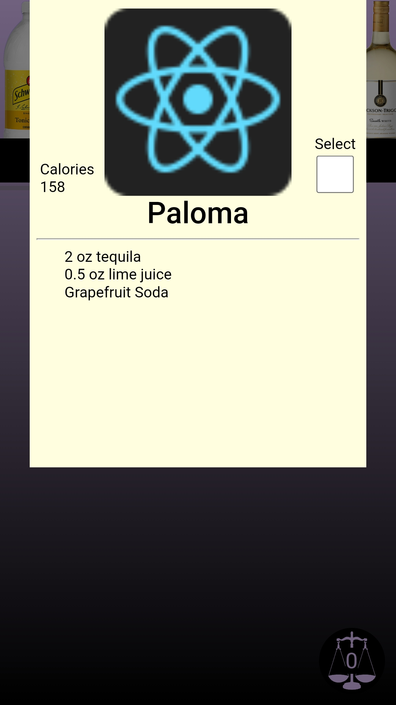
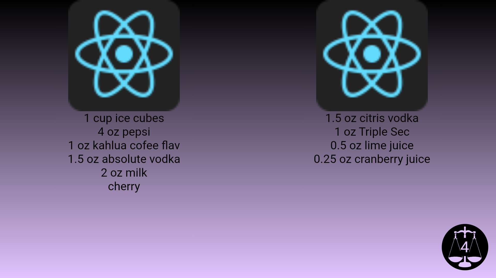

    <h1><b><a href="https://daneharrison.github.io/Digi-Menu/">Digi-Menu</a></b></h1>
<h3>An experimental digital menu design with comparing features</h3>

 
 

### Content
- [Why](#why)
- [Demo](#demo)
- [Features](#features)
    - [Drink filtering]()
    - [View recipe details]()
    - [Select drinks]()
    - [Track selection count]()
    - [Drink Comparison]()
    - [Automatic screen rotation]()
    - [Curated drinks]()
- [Making adjustments]()

 

## why

## Features:
1. ### **Filter drinks by type**
    - By clicking on the respective bottle type, the user updates to match their selected drink type 
    - There is a text indicator as to which type is currently selected, this changes when a new type is chosen
    - Only bottles with available drinks are shown

 

2. ### **View drink recipes and details**
    - If a user is interested in a drink they can click on its card. This brings up a popup that displays:
        - A better view of the drink name and picture
        - Calories
        - A selection checkbox (used for comparison)
        - A list of ingredients they can scroll through
    - To get out the user needs to click anywhere outside of the popup

 

3. ### **View how many drinks are selected**
    - At the bottom of the screen there is a button that houses a scale with a number showcasing how many drinks a user may be interested in

 

4. ### **Drink comparison**
    - By rotating their screen, the UI changes to better compare selections displaying the drinks photo and ingredients
        - A user can scroll right/left to increase/decrease the number of drinks to compare at once (supports 1 - 4 total)
        - A user can scroll up and down on each drink's section to cycle through all of their selections
    - A user can exit this view by rotating their phone back to portait mode 

 

5. ### **Automatic screen rotation**
    - Because it may not be immediately obvious the user can rotate their screen - the button at the bottom that updates the number of selected drinks when pressed either...
        - Puts the device into fullscreen mode and rotates automatically (android)
        - Prompts the user to manually rotate their screen (apple)
    - A user can either leave fullscreen once they learn of this feature or they can continue clicking on the button to stay in fullscreen and have the phone control the flip for them

 

5. ### **Curated drinks**
    - Although hidden the menu supports drink curation functionality with a hidden text input field and submission button
    - When found a user can type in any of the relevant drink tags largely made of drink types or people who may use the menu 

  

## Photos:                                 

 | 
:-:|:-:

  
