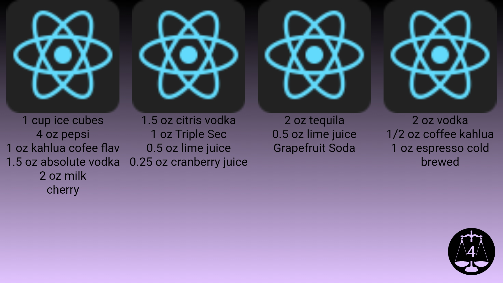
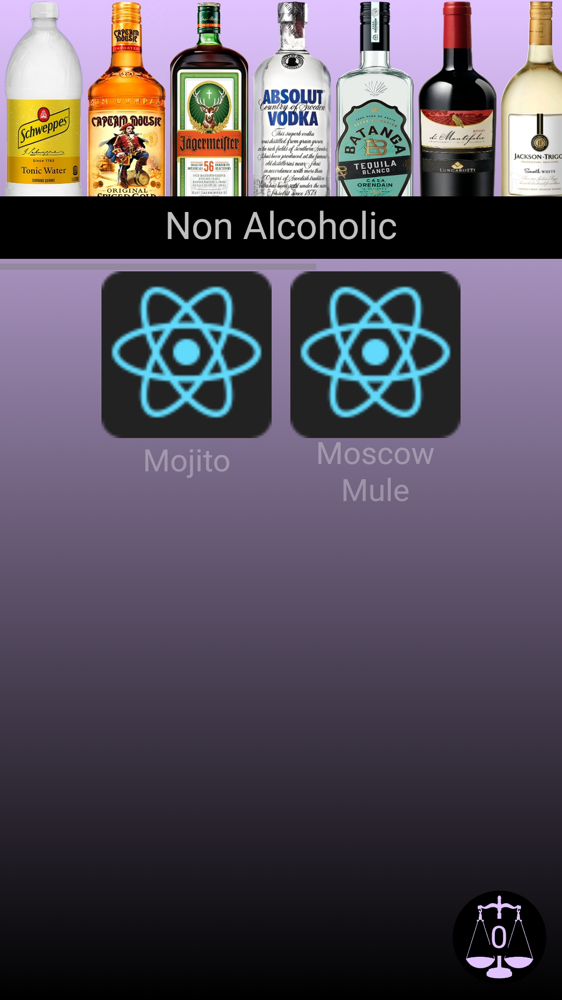

<div align="center">
    <h1><b><a href="https://daneharrison.github.io/Digi-Menu/">Digi-Menu</a></b></h1>
<h3>An experimental digital menu design with comparing features</h3>
</div>

<br>
<br>

<div align='right'>


</div>

### Content
- [Motivation](#motivation)
- [Features](#features)
    - [Drink filtering](#filter-drinks-by-type)
    - [View recipe details](#view-drink-recipes-and-details)
    - [Select drinks](#select-drinks)
    - [Drink Comparison](#drink-comparison)
    - [Automatic screen rotation](#automatic-screen-rotation)
    - [Curated drinks](#curated-drinks)
    - [Improved learnability](#improved-learnability)
    - [Responsive design](#responsive-design)
- [Adjusting the Menu](#adjusting-the-menu)
- [Running locally](#running-locally)

<br>

## Motivation
[Culture Code](https://www.amazon.ca/Culture-Code-Secrets-Highly-Successful/dp/0804176981) by Daniel Coyle, in my opinion, is a must read for anyone looking to improve their social awareness and develop better social skills. While I was reading his book, (see my [notes here](https://github.com/DaneHarrison/Hacker-Man/blob/main/think%20tank/communication/cultureCode.pdf) if interested) one chapter stuck out to me in particular. 

Daniel Coyle spoke of a basketball coach who led his team to victory against impressive odds. One of the many contributing factors to their success was the level of care the coach showed their team, he simplified their lives and remembered many minute details including their favourite foods and drinks.

<br>

## Features:
1. ### Filter drinks by type
    - Selecting any of the bottles updates the user's drink options to align with what can be prepared using the currently chosen bottle
    - The bottle currently chosen is more opaque
    - The bottle that is currently chosen also has its name shown
    - Always shows users non alcoholic drinks first by default
    - Bottles are dynamically shown based on their drink availability 
        - i.e if none are present the bottle is not shown

2. ### View drink recipes and details
    - If a user is interested in a drink they can click on its card. This brings up a popup that displays:
        - A better view of the drink name and picture
        - Calories
        - A selection checkbox (used for comparison)
        - A list of ingredients they can scroll through
    - Like other modals, to get out the user needs to click anywhere outside of the popup

3. ### Select drinks
    - As previously mentioned when you go to view a drink there is a selection checkbox, by checking a drinnk, you will able to compare it to others more easily 
    - At the bottom of the screen there is a button that houses a scale with a number showcasing how many drinks a user may be interested in

4. ### Drink comparison
    - By rotating their screen, the UI changes to better compare selections displaying the drinks photo and ingredients
        - A user can scroll right/left to increase/decrease the number of drinks to compare at once (supports 1 - 4 total)
        - A user can scroll up and down on each drink's section to cycle through all of their selections
    - A user can exit this view by rotating their phone back to portait mode 
    - A user can unselect all drinks if they so wish

5. ### Automatic screen rotation
    - Because it may not be immediately obvious the user can rotate their screen - the button at the bottom that updates the number of selected drinks when pressed either...
        - Puts the device into fullscreen mode and rotates automatically (android)
        - Prompts the user to manually rotate their screen (apple)
    - A user can either leave fullscreen once they learn of this feature or they can continue clicking on the button to stay in fullscreen and have the phone control the flip for them


6. ### Curated drinks
    - Although hidden the menu supports drink curation functionality with a hidden text input field and submission button
    - When found a user can type in any of the relevant drink tags largely made of drink types or people who may use the menu 

7. ### Improved learnability
    - Easily the biggest problem when using this application is field testing was its novelty. Interactions were not obviously not very intuitive. Therefore to fix this:
        - Bottles automatically scroll when the main page is loaded, movement catches users eyes and shows them that the bottles are infact interactable
        - Brief instructions have been added to the comparison tab (scroll up, down, left, right and their associated effects)

<br>

8. ### Responsive design
    - Supports mobile, tablet and desktop experiences
    - Due to the initial design and its mobile first inspirations, the design does not translate as well onto larger screens 
        - This would require a redesign i.e fitting 1 - 4 drinks of a large screen gives poor resolution and also does not make much sense

<br>

## Adjusting the Menu
The menu is entirely controlled by a [JSON file](https://github.com/DaneHarrison/Digi-Menu/blob/main/src/assets/menu.json) which makes it very easy to update. An example of a drink entry is as follows:

    {
        "id": 0,
        "name": "Mojito",
        "photo": "./drinks/mojito.png",
        "calories": 155,
        "available": true,
        "ingredients": [
            "10 Mint Leaves",
            "1 tbsp Lime Juice",
            "2 tbsp Sugar",
            "Tonic Water"
        ],
        "tags": [
            "Non Alcoholic",
            "Josef",
            "Tori"
        ]
    }

- id is a unique identifier
- available indicates ingredient availability as well as an easy way to toggle recipes on and off
- Tags associate drinks to bottles as well as users to their curated menus
- note that ***drink photos*** should be added [here](https://github.com/DaneHarrison/Digi-Menu/tree/main/public/drinks) and ***photos of bottles*** should be added [here](https://github.com/DaneHarrison/Digi-Menu/tree/main/public/bottles)

<br>

## Running locally
Note that Digi Menu will not run locally (at least not properly anyways) if package.json contains the following line: 
```"homepage": "https://DaneHarrison.github.io/Digi-Menu",```

Remove it and your good to go!